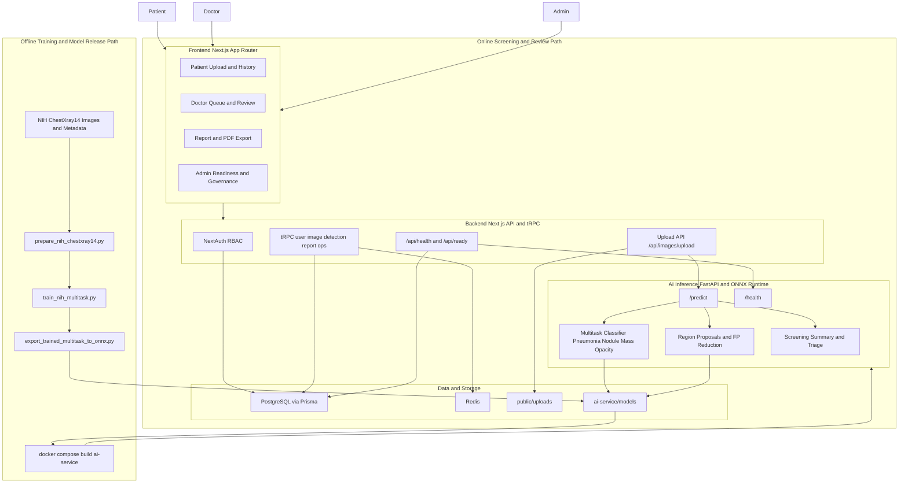

# X-ray Lung Detection System

AI-assisted chest X-ray screening platform with role-based workflow for patient upload, doctor review, and report generation.

## Documentation Languages

- English: `README.md`
- 简体中文: `README.zh-CN.md`

## Current Status

- Frontend/Backend: Next.js + tRPC + Prisma + PostgreSQL
- AI Service: FastAPI + ONNX Runtime
- AI tasks:
  - A: Pneumonia risk
  - B: Nodule/Mass lesion risk
  - C: Infection coverage spectrum + white-lung quantification (screening-level)
- Core screening workflow:
  - Unified `screeningSummary` generated on upload (pneumonia + lesion + white-lung + triage priority)
  - Doctor queue prioritization uses screening triage when available
  - Review and report pages display structured screening metrics
- Compliance posture:
  - Heuristic pseudo bounding boxes are disabled by default
  - Output marked `RESEARCH_ONLY` (non-clinical use)
  - High-sensitivity and high-specificity decision thresholds supported
  - Clinical evidence ledger + governance gate + ops incident management added (admin)

## System Architecture



### Architecture Summary

- Online path: patient upload -> backend workflow -> AI inference -> doctor review -> report and PDF export.
- Offline path: NIH dataset preparation -> multitask training -> ONNX export -> model release into `ai-service/models` -> AI service rebuild.
- Frontend: Next.js pages cover patient, doctor, and admin roles.
- Backend: Next.js API + tRPC manage workflow and governance; NextAuth enforces RBAC.
- AI service: FastAPI exposes `/predict` and `/health`, with multitask scores, region proposals, and screening summary output.
- Data/storage: PostgreSQL stores business and governance data; Redis supports cache/scale; image files in `public/uploads`.

## Quick Start

### 1. Install dependencies

```bash
npm install
```

### 2. Start infra and AI service

```bash
docker compose up -d
```

### 3. Setup database

```bash
npx prisma generate
npx prisma migrate dev --name init
```

### 4. Start app

```bash
npm run dev
```

App URL: `http://localhost:3000`

## Minimum Hardware Baseline (Current Version)

Baseline for current code and `npm run train:best`:

- Training (full NIH dataset + offline resize + multitask training):
  - GPU: NVIDIA CUDA GPU with `>= 12GB` VRAM (RTX 4070-class recommended)
  - CPU: `>= 8` cores (`12~16` threads recommended)
  - RAM: `>= 32GB`
  - Storage: NVMe SSD with `>= 600GB` free (HDD strongly discouraged)
- Inference deployment (ONNX Runtime + FastAPI):
  - CPU-only: `>= 4` cores, `>= 8GB` RAM
  - GPU inference: NVIDIA CUDA GPU with `>= 6GB` VRAM (`>= 8GB` recommended)
  - Storage: `>= 20GB` free

Notes:
- If GPU utilization is low while CPU is saturated, move dataset to NVMe SSD first, then increase `--num-workers` (current recommendation: `16`).
- If VRAM is insufficient, reduce `--batch-size` from `64` to `48` or `32`.

## AI Model Workflow

### Export multitask ONNX

```bash
cd ai-service
python -m venv .venv_export
.venv_export\Scripts\activate
pip install -r requirements-export.txt
python scripts/export_torchxrayvision_multitask_to_onnx.py --output ../models/cxr_multitask.onnx
```

Output channel order:
1. Pneumonia
2. Nodule
3. Mass
4. Lung Opacity

### Rebuild AI service

```bash
cd ..
docker compose up -d --build ai-service
```

### Health check

```bash
Invoke-RestMethod http://localhost:8000/health
```

Expected key fields:
- `modelLoaded: true`
- `modelPath: /app/models/cxr_multitask.onnx`
- `modelVersion: cxr-multitask-v1`
- `heuristicRegionsEnabled: false`

## Evaluation

Prepare CSV with columns:
- `y_true` (0/1)
- `y_score` (0~1)

Run:

```bash
python ai-service/scripts/evaluate_predictions.py --csv .\your_val.csv --thr-sens 0.30 --thr-spec 0.70 --out .\eval_report.json
```

Report includes:
- AUROC
- ECE (10 bins)
- High-sensitivity operating point metrics
- High-specificity operating point metrics

### Fastest Path (Use One Command)

If you just want the best-practice training pipeline without tuning dozens of flags, run:

```bash
npm run train:best
```

Default flow:
- optional offline resize to 512
- train with best-practice defaults
- CUDA preflight first (prints `torch/cuda` info); if CUDA is unavailable in current Python env, script fails fast.

Optional flags:

```bash
npm run train:best -- -ExportOnnx -RebuildAi
npm run train:best -- -DatasetRoot "E:\datasets\ChestXray-NIHCC" -ResizedRoot "E:\datasets\ChestXray-NIHCC-512"
npm run train:best -- -SkipResize -ResizedRoot "E:\datasets\ChestXray-NIHCC"
```

Below is the equivalent manual flow (reference only).

## Clinical Evidence And Ops Readiness

### Why this was added

- To reduce "clinical evidence不足": every validation run can be persisted with metrics and approvals.
- To reduce "production ops不足": readiness probe and incident tracking are available for admin operations.

### New backend capabilities

- Prisma model: `clinical_evidence_runs`
  - Tracks model version, dataset, sample/site size, AUROC/sensitivity/specificity, calibration/threshold metadata, regulatory status, stage recommendation.
- Prisma model: `ops_incidents`
  - Tracks incident severity (`P0~P3`), source, status (`OPEN/ACKNOWLEDGED/RESOLVED`), owner and timestamps.
- tRPC router: `ops`
  - `ops.readiness`: DB + AI liveness/readiness + latest evidence gate result.
  - `ops.dashboard`: latest evidence summary + open incidents + open P0/P1 incidents.
  - `ops.listEvidence` / `ops.createEvidence`
  - `ops.listIncidents` / `ops.createIncident` / `ops.transitionIncident`
- HTTP endpoints:
  - `GET /api/health`: app + DB health.
  - `GET /api/ready`: readiness for DB and AI service.

### Admin page updates

`/dashboard/admin` now shows:
- System readiness (DB/AI)
- Clinical evidence gate PASS/NOT PASS
- Open P0/P1 incidents
- Recent incident list

### Required DB migration

After pulling latest code, run:

```bash
npx prisma generate
npx prisma migrate dev --name add_clinical_evidence_and_ops
```

## Clinically-Oriented Parameter Tuning

Use validation data to derive calibration temperature and operating points instead of hardcoding.

Input CSV format:
- `task` in `pneumonia` or `lesion`
- `y_true` in `0/1`
- `y_score` in `0~1`
- optional `y_logit`

Run:

```bash
python ai-service/scripts/derive_clinical_config.py --csv .\clinical_val.csv --target-sens 0.95 --target-spec 0.90 --out .\ai-service\models\clinical_config.json
```

Then restart AI service:

```bash
docker compose up -d --build ai-service
```

Service will auto-load `AI_CLINICAL_CONFIG_PATH` (default `/app/models/clinical_config.json`).
Check `/health` for:
- `taskThresholds`
- `clinicalConfigSource`

### Clinical deployment gate

The service reads `AI_CLINICAL_GOVERNANCE_PATH` (default `/app/models/clinical_governance.json`).

- If governance file is missing/invalid, stage stays `RESEARCH_ONLY`.
- To move to decision-support stages, provide approved governance evidence.
- Stage is exposed via `/health` and `/predict` (`clinicalStage`).

Template:
- `ai-service/models/clinical_governance.example.json`

### Lesion localization upgrade path

- If `AI_DETECTOR_MODEL_PATH` exists (default `/app/models/cxr_detector.onnx`), service uses detector ONNX outputs for regions.
- Supported detector output styles:
  - `xyxy + score + class`
  - YOLO-like `cx,cy,w,h + class_probs`
- If detector model is absent, no regions are returned (or optional heuristic fallback if explicitly enabled).

### Detector output self-check (recommended before deployment)

```bash
python ai-service/scripts/check_detector_onnx.py --model ../models/cxr_detector.onnx --size 640
```

This script verifies:
- ONNX input/output tensor metadata
- Runtime output shape with a dummy tensor
- Whether the output layout is compatible with current decoder logic

### Detector manifest and hash pinning (recommended)

Generate profile + sha256:

```bash
python ai-service/scripts/generate_detector_manifest.py --model .\ai-service\models\cxr_detector.onnx --profile-out .\ai-service\models\detector_profile.json --sha-out .\ai-service\models\detector.sha256 --decoder-format auto --input-channels 1
```

Then set in `.env`:
- `AI_DETECTOR_PROFILE_PATH=/app/models/detector_profile.json`
- `AI_DETECTOR_SHA256=<content of detector.sha256>`

Startup will fail if model hash mismatches expected hash.

### Reproducibility check (same image, repeated inference)

```bash
python ai-service/scripts/check_detector_reproducibility.py --model .\ai-service\models\cxr_detector.onnx --image .\public\uploads\your_test_image.png --runs 20 --size 640 --out .\ai-service\models\repro_report.json
```

The script exits with non-zero code if max score/box drift exceeds configured eps.

### Train with NIH ChestXray14 (Google-hosted NIH dataset)

Dataset source you provided:
- `https://nihcc.app.box.com/v/ChestXray-NIHCC`

Expected local layout (after download/extract):
- `Data_Entry_2017.csv`
- image files under one or more subfolders (script will recursively scan)

Install training dependencies (outside Docker, local Python):

```bash
python -m pip install -r ai-service/requirements-train.txt
```

Optional: automated download + integrity check script

```bash
python ai-service/scripts/prepare_nih_chestxray14.py --dataset-root "E:\datasets\ChestXray-NIHCC" --download --extract --verify --report "E:\datasets\ChestXray-NIHCC\nih_integrity_report.json"
```

Notes:
- Download supports resume and stores archives in `dataset-root/downloads`.
- Extraction writes images into `dataset-root/images`.
- Verification checks archive readability and CSV/image coverage.

Manual equivalent (same as `npm run train:best`):

1. Optional resize

```bash
python ai-service/scripts/prepare_nih_resized_dataset.py --dataset-root "E:\datasets\ChestXray-NIHCC" --output-root "E:\datasets\ChestXray-NIHCC-512" --size 512 --quality 90 --workers 16 --skip-existing
```

2. Train

```bash
python -c "import torch; print(torch.__version__, torch.version.cuda, torch.cuda.is_available(), torch.cuda.get_device_name(0) if torch.cuda.is_available() else 'CPU')"
python ai-service/scripts/train_nih_multitask.py --dataset-root "E:\datasets\ChestXray-NIHCC-512" --split-mode nih_official --backbone efficientnet_v2_s --image-size 320 --epochs 8 --batch-size 64 --amp --num-workers 16 --prefetch-factor 4 --output-dir "ai-service/models"
```

3. Export + deploy

```bash
python ai-service/scripts/export_trained_multitask_to_onnx.py --checkpoint "ai-service/models/nih_multitask_efficientnet_v2_s_best.pt" --output "../models/cxr_multitask.onnx" --input-size 320
docker compose up -d --build ai-service
```

### Startup gate (auto fail-fast)

The AI service now performs detector compatibility self-check at startup.

- `AI_ENFORCE_DETECTOR_STARTUP_CHECK=true` (default): if detector output is incompatible, service startup fails.
- `AI_ENFORCE_DETECTOR_STARTUP_CHECK=false`: service starts but detector is disabled.

Check gate status in `/health`:
- `detectorStartupCheckPassed`
- `detectorStartupCheckMessage`

### Governance gate (clinical stage guard)

The service enforces governance requirements before allowing decision-support stages.

Config:
- `AI_ENFORCE_GOVERNANCE_GATE=true`
- `AI_GOV_MIN_SITE_COUNT=2`
- `AI_GOV_MIN_AUROC=0.90`
- `AI_GOV_MIN_SENSITIVITY=0.90`
- `AI_GOV_MIN_SPECIFICITY=0.85`

Behavior:
- If `deploymentStage=RESEARCH_ONLY`, gate always passes.
- If `deploymentStage=PILOT_DECISION_SUPPORT` or `CLINICAL_DECISION_SUPPORT`, gate checks external validation metrics.
- For `CLINICAL_DECISION_SUPPORT`, regulatory status must be one of `APPROVED/CLEARED/CERTIFIED`.

Health endpoint fields:
- `governanceGatePassed`
- `governanceGateMessage`
- `governanceCriteria`

## Security and Access Rules

- Public registration allows `PATIENT` only.
- Patient can only access own images/detections/reports.
- Hard delete of images is disabled (audit integrity).
- Upload filename is server-generated (`timestamp + uuid + safe extension`).
- AI upload max size is enforced (default 10MB).
- Non-local production deployment requires non-default `NEXTAUTH_SECRET`.

## Main Commands

```bash
npm run dev
npm run build
npm run lint
npx prisma studio
docker compose up -d
docker compose logs -f ai-service
```

## Key Paths

- `app/` Next.js pages and API routes
- `server/` tRPC routers and compliance logic
- `prisma/schema.prisma` data models
- `ai-service/app/main.py` AI inference service
- `ai-service/scripts/` model export and evaluation scripts

## Notes

- This system is for research/decision support, not standalone clinical diagnosis.
- For full setup details and troubleshooting, see `SETUP.md`.
