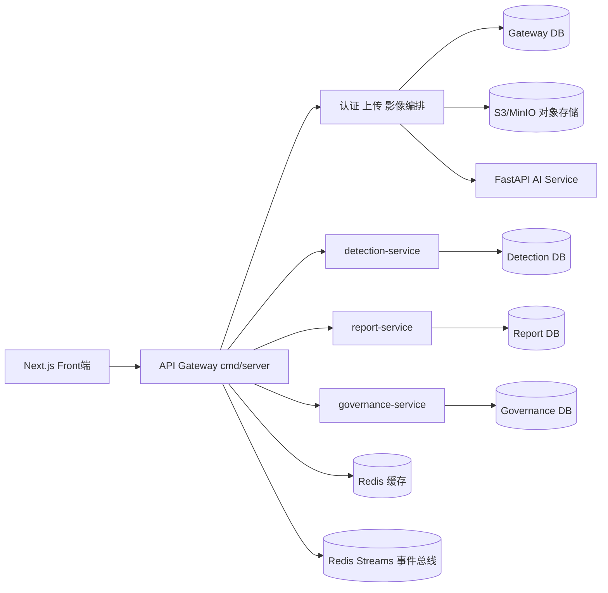
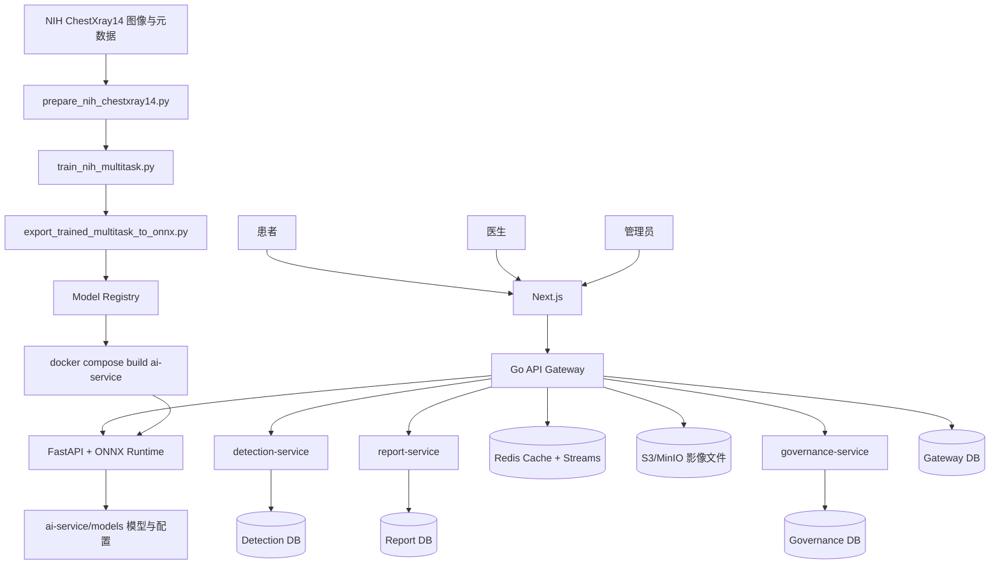

# X 光肺部检测系统

面向胸部 X 光的 AI 辅助筛查平台，支持患者上传、医生审阅、报告生成与管理后台。

## 文档语言

- 当前文档：`README.md`（中文）
- 中文副本：`README.zh-CN.md`

## 当前状态

- 前端：Next.js（保留）
- 后端：Go Gin（`backend-go`，已承接认证/上传/影像文件读取/健康检查）
- AI 服务：FastAPI + ONNX Runtime
- AI 任务：
  - A：肺炎风险
  - B：结节/肿块病灶风险
  - C：感染覆盖风险谱 + 白肺量化（筛查级）
- 核心筛查流程：
  - 上传时自动生成统一 `screeningSummary`（肺炎 + 病灶 + 白肺 + 分诊优先级）
  - 医生队列可按分诊优先级处理病例
  - 审阅页与报告页展示结构化筛查结果
- 合规与运维：
  - 默认关闭伪病灶框启发式输出
  - 默认 `RESEARCH_ONLY`（研究/辅助用途）
  - 支持高敏/高特双工作点
  - 已接入临床证据台账、治理门禁、运维事件管理

## 后端架构（Gin 微服务）

后端详细架构图与拆分策略见：

- `backend-go/MICROSERVICES.md`

简图如下：



约束：前端不允许直连 `ai-service`，必须由后端服务在服务端内网调用 AI。

## 系统架构



## 架构说明

- 在线链路：患者上传 -> 后端编排 -> AI 推理 -> 医生审阅 -> 报告与 PDF 导出。
- 离线链路：NIH 数据准备 -> 多任务训练 -> ONNX 导出 -> 发布到 `ai-service/models` -> 重建 AI 服务。
- 前端：Next.js 覆盖患者、医生、管理员三类角色。
- 后端：Go Gin Gateway + detection/report/governance 三服务为唯一业务入口；Next.js 仅承载页面与会话能力。
- AI 服务：FastAPI 暴露 `/predict` 与 `/health`，输出多任务分数、候选区域与筛查摘要。
- 数据与存储：PostgreSQL 按服务拆分（`GATEWAY/DETECTION/REPORT/GOVERNANCE_DATABASE_URL`），Redis 用于缓存与事件流，影像文件目标存储为 S3/MinIO（当前可兼容本地目录）。

## 快速开始

### 1. 安装依赖

```bash
npm install
```

### 2. 启动基础服务与 AI 服务

```bash
docker compose up -d
```

该命令会同时启动 `backend-go`（默认 `http://localhost:8080`）。

### 3. 初始化数据库

```bash
npx prisma generate
npx prisma migrate dev --name init
```

### 4. 启动 Web 应用

```bash
npm run dev
```

访问地址：`http://localhost:3000`

如需本地直接启动 Go 后端（不走 Docker）：

```bash
npm run dev:backend
```

## 最低硬件标准（当前版本）

以下是按当前代码与 `npm run train:best` 给出的最低可运行基线：

- 训练（NIH 全量 + 离线缩放 + 多任务训练）：
  - GPU：NVIDIA CUDA 显卡，显存 `>= 12GB`（建议 RTX 4070 或同级）
  - CPU：`>= 8` 核（建议 `12~16` 线程以上）
  - 内存：`>= 32GB`
  - 磁盘：NVMe SSD，可用空间 `>= 600GB`（强烈不建议 HDD）
- 推理部署（ONNX Runtime + FastAPI）：
  - CPU 部署：`>= 4` 核，内存 `>= 8GB`
  - GPU 部署：NVIDIA CUDA 显卡，显存 `>= 6GB`（建议 `>= 8GB`）
  - 磁盘：可用空间 `>= 20GB`

说明：
- 如果训练时 GPU 利用率低、CPU 满载，优先检查数据是否在 NVMe SSD，并提高 `--num-workers`（当前推荐 `16`）。
- 若显存不足，可把 `--batch-size` 从 `64` 下调到 `48` 或 `32`。

## AI 模型流程

### 导出多任务 ONNX

```bash
cd ai-service
python -m venv .venv_export
.venv_export\Scripts\activate
pip install -r requirements-export.txt
python scripts/export_torchxrayvision_multitask_to_onnx.py --output ../models/cxr_multitask.onnx
```

导出通道顺序：
1. Pneumonia
2. Nodule
3. Mass
4. Lung Opacity

### 重建 AI 服务

```bash
cd ..
docker compose up -d --build ai-service
```

### 健康检查

```bash
Invoke-RestMethod http://localhost:8000/health
```

关键字段期望值：
- `modelLoaded: true`
- `modelPath: /app/models/cxr_multitask.onnx`
- `modelVersion: cxr-multitask-v1`
- `heuristicRegionsEnabled: false`

### 部署端推理优化（ONNX Runtime + FastAPI）

- CUDA EP 与 IOBinding：
  - `AI_ORT_PREFER_CUDA=true`
  - `AI_ORT_ENABLE_IO_BINDING=true`
  - `AI_ORT_CUDA_DEVICE_ID=0`
  - `AI_ORT_GRAPH_OPT_LEVEL=all`
- `/health` 可查看：
  - `ortAvailableProviders`
  - `modelActiveProviders`
  - `detectorActiveProviders`
- 前提：部署环境需安装 GPU 版本 ORT（`onnxruntime-gpu`）并具备 CUDA 运行时；否则会自动回退 `CPUExecutionProvider`。

说明：
- 当前分类模型 `cxr_multitask.onnx` 已是“单模型多任务头”，天然共享 Backbone（已完成你说的分类多模型融合思路）。
- 目前检测模型 `cxr_detector.onnx` 仍是独立图。如果后续要进一步降低总延迟，可考虑把检测与分类做联合导出（工程改造较大，需同步改解码逻辑）。

## 评估与校准

准备验证集 CSV 字段：
- `y_true`（0/1）
- `y_score`（0~1）

运行评估：

```bash
python ai-service/scripts/evaluate_predictions.py --csv .\your_val.csv --thr-sens 0.30 --thr-spec 0.70 --out .\eval_report.json
```

输出指标包括：
- AUROC
- ECE（10 bins）
- 高敏工作点指标
- 高特工作点指标

### 最短路径（只看这个）

如果你只想先跑通一版模型，现在只需要 **一个命令**：

```bash
npm run train:best
```

默认会执行：离线缩放(512) -> 训练(最佳实践参数)。
训练时会保存每轮权重到 `ai-service/models/epochs/epoch_*.pt`，方便直接拿 `epoch_3.pt` 做推理对比。
脚本会先做 CUDA 预检（打印 `torch/cuda` 信息），若当前 Python 不是 GPU 版 PyTorch，会直接失败并停止后续步骤。

可选参数示例（导出 ONNX 并重建 AI 服务）：

```bash
npm run train:best -- -ExportOnnx -RebuildAi
```

你仍然可以按需覆盖数据集路径：

```bash
npm run train:best -- -DatasetRoot "E:\datasets\ChestXray-NIHCC" -ResizedRoot "E:\datasets\ChestXray-NIHCC-512"
```

如果你不想缩放，直接用原数据训练：

```bash
npm run train:best -- -SkipResize -ResizedRoot "E:\datasets\ChestXray-NIHCC"
```

下面是等价的手动 3 步（仅供参考）：

1. 可选：先把 1024 原图离线缩放（建议，能明显提速）

```bash
python ai-service/scripts/prepare_nih_resized_dataset.py --dataset-root "E:\datasets\ChestXray-NIHCC" --output-root "E:\datasets\ChestXray-NIHCC-512" --size 512 --quality 90 --workers 16 --skip-existing
```

2. 训练（新手推荐这一条）

```bash
python -c "import torch; print(torch.__version__, torch.version.cuda, torch.cuda.is_available(), torch.cuda.get_device_name(0) if torch.cuda.is_available() else 'CPU')"
python ai-service/scripts/train_nih_multitask.py --dataset-root "E:\datasets\ChestXray-NIHCC-512" --split-mode nih_official --backbone efficientnet_v2_s --image-size 320 --epochs 8 --batch-size 64 --amp --num-workers 16 --prefetch-factor 4 --output-dir "ai-service/models"
```

提速建议（默认 `batch_size=32`，这里已提升到 `64`）：
- 如果显存还有余量，可继续尝试 `96` 或 `128`。
- 如果出现显存不足（OOM），回退到 `48` 或 `32`。
- 训练时用 `nvidia-smi -l 1` 观察 `GPU-Util`。
- 若 CPU 接近满载但 GPU 利用率不高，说明数据加载可能是瓶颈，可优先：
  - 提高 `--num-workers`（如 `12~16`）
  - 保持 `--prefetch-factor 4`
  - 使用离线缩放后的数据集（如 `ChestXray-NIHCC-512`）

3. 导出 ONNX 并部署

```bash
python ai-service/scripts/export_trained_multitask_to_onnx.py --checkpoint "ai-service/models/nih_multitask_efficientnet_v2_s_best.pt" --output "../models/cxr_multitask.onnx" --input-size 320
docker compose up -d --build ai-service
```

说明：
- 如果你没做第 1 步，把第 2 步里的 `--dataset-root` 改回 `E:\datasets\ChestXray-NIHCC` 即可。
- 其余章节都是“提分优化项”，不是必须。

## 临床证据与运维就绪

- `clinical_evidence_runs`：记录验证数据集、样本量、多中心站点数、AUROC/敏感度/特异度、审批信息
- `ops_incidents`：记录 P0~P3 事件、状态流转、责任人
- 管理后台可查看：
  - 系统就绪状态（DB/AI）
  - 临床证据门禁是否通过
  - P0/P1 未关闭事件数

必要迁移命令：

```bash
npx prisma generate
npx prisma migrate dev --name add_clinical_evidence_and_ops
```

## 安全与访问规则

- 公共注册仅允许 `PATIENT`
- 患者仅可访问自己的影像/检测/报告
- 禁止硬删除影像（保障审计可追溯）
- 上传文件名由服务端生成
- 默认限制 AI 上传大小（10MB）
- 生产环境必须设置非默认 `NEXTAUTH_SECRET`

## 常用命令

```bash
npm run dev
npm run build
npm run lint
npx prisma studio
docker compose up -d
docker compose logs -f ai-service
```

## 关键路径

- `app/`：Next.js 页面与 API
- `server/`：服务端适配与历史兼容代码（业务主路径已收敛到 Go Gateway）
- `prisma/schema.prisma`：数据库模型
- `ai-service/app/main.py`：AI 推理服务
- `ai-service/scripts/`：模型导出与评估脚本

## 说明

- 当前系统定位为研究/辅助筛查，不可替代临床最终诊断。
- 详细环境搭建与排障请查看 `SETUP.md` 或 `SETUP.zh-CN.md`。
