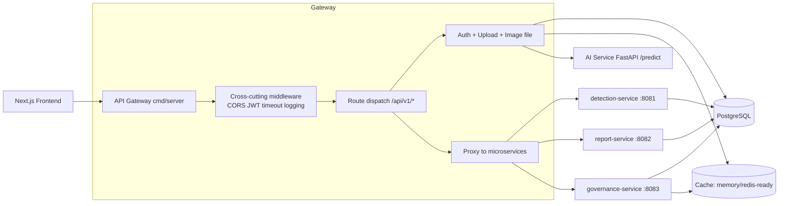
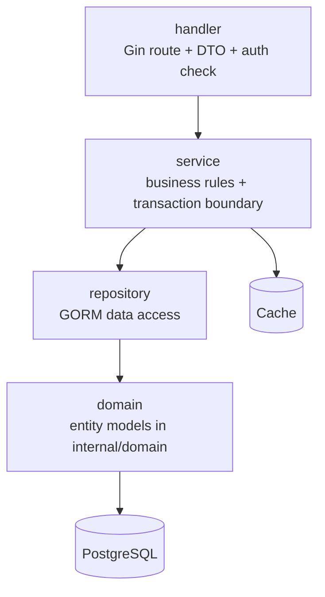

# Backend Architecture (Gin Microservices)

## Service Topology

- `api-gateway` (`cmd/server`): auth, image upload/file access, JWT middleware, proxy and compatibility routing.
- `detection-service` (`cmd/detection-service`): detection query/review domain.
- `report-service` (`cmd/report-service`): report query/create/update domain.
- `governance-service` (`cmd/governance-service`): audit, analytics, ops domain.

## Backend Architecture Diagram

## AI Call Boundary

- Frontend must call backend APIs only.
- AI service is called by backend server-side handlers/services (for example image upload detection flow).
- Do not expose direct frontend -> ai-service integration in page code.
- Recommended deployment: keep `ai-service` on internal network; backend accesses it via `AI_SERVICE_URL`.

## Layered Design (Per Service)

## Gateway Routing

Gateway keeps API paths unchanged (`/api/v1/*`) and proxies by env:

- `DETECTION_SERVICE_URL=http://localhost:8081`
- `REPORT_SERVICE_URL=http://localhost:8082`
- `GOVERNANCE_SERVICE_URL=http://localhost:8083`

If env var is empty, gateway falls back to local handler for compatibility.

## Current Refactor Status

- ORM models are centralized in `internal/domain`.
- `audit` has been split into `repository/service/handler` and wired into gateway app DI.
- Detection/report/governance standalone binaries are scaffolded and healthy.
- Remaining domains are being migrated incrementally to full 3-layer service modules.

## Observability

- Baseline observability design and metrics are documented in:
  - `backend-go/OBSERVABILITY.md`
