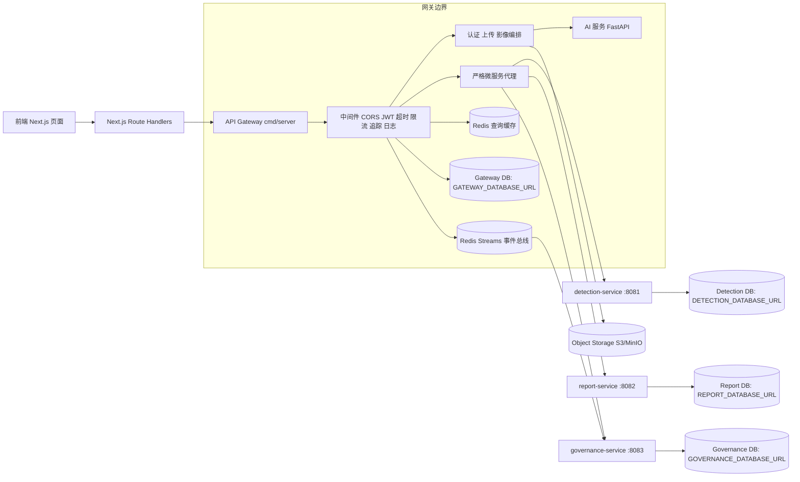
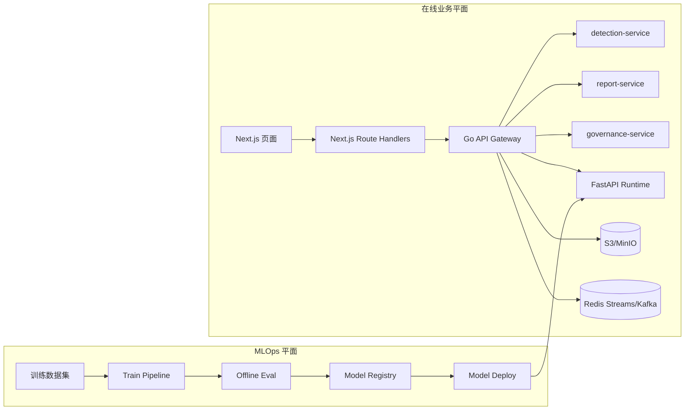
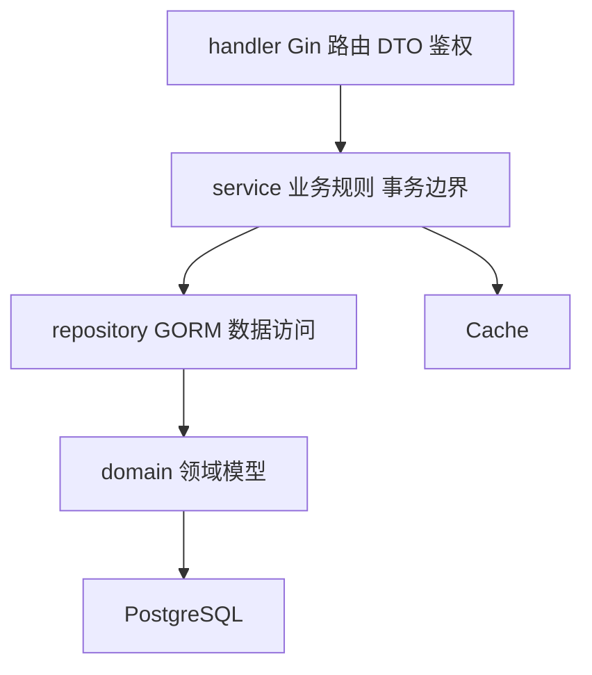

# 后端架构（Gin 微服务）

## 服务拓扑

- `api-gateway`（`cmd/server`）：认证、影像上传/文件访问、JWT 中间件、代理与兼容路由。
- `detection-service`（`cmd/detection-service`）：检测查询与复核域。
- `report-service`（`cmd/report-service`）：报告查询/创建/更新域。
- `governance-service`（`cmd/governance-service`）：审计、分析、运维域。

## 后端架构图

## 在线与 MLOps 双平面（目标）

## AI 调用边界

- 前端只能调用后端 API。
- AI 服务必须由后端服务端处理器/服务层调用（如上传后检测流程）。
- 页面代码中禁止前端直连 `ai-service`。
- 建议部署为内网调用：`ai-service` 仅对后端开放，通过 `AI_SERVICE_URL` 访问。

## 分层设计（单服务）

## 组合根与依赖注入

- 网关 DI 组合根：`internal/platform/bootstrap/gateway.go`
- 服务与仓储在组合根统一构造，再注入到 handler。
- handler 内不直接创建 DB 连接、缓存客户端或仓储对象。
- 这样可保持测试边界清晰，避免隐藏耦合。

## 弹性设计

- 网关中间件层入站限流（`429` 保护）。
- 对 AI 与 HTTP 上游的出站保护：
  - 按键令牌桶限流
  - 熔断器（closed/open/half-open）
- 支持环境变量配置：
  - `INBOUND_RATE_LIMIT_RPS`, `INBOUND_RATE_LIMIT_BURST`
  - `AI_OUTBOUND_RATE_LIMIT_RPS`, `AI_OUTBOUND_RATE_LIMIT_BURST`
  - `UPSTREAM_BREAKER_FAIL_THRESHOLD`, `UPSTREAM_BREAKER_OPEN_SECONDS`, `UPSTREAM_BREAKER_HALF_OPEN_CALLS`

## 缓存策略

- 缓存后端由 `CACHE_BACKEND` 决定（`redis|memory|noop`）。
- 生产环境默认缓存后端为 Redis：
  - `APP_ENV=production|prod` 且未设置 `CACHE_BACKEND` 时，默认 `redis`。
- Redis 可用性策略：
  - `CACHE_REQUIRED=false`（默认）：Redis 不可用自动降级到内存缓存并告警。
  - `CACHE_REQUIRED=true`：Redis 不可用时启动失败（fail-fast）。
- 缓存只用于读多写少的查询接口（如 detection/report/audit/analytics/ops 列表或概览）。
- 认证、上传、AI 调用链路不走缓存，保证强一致与安全边界。
- 网关在本地 handler、gRPC 桥接、HTTP 代理三种路由模式下统一执行缓存命中与写后失效。

## 对象存储（S3/MinIO）

- 影像上传与读取链路已统一走对象存储，不再依赖本地 `public/uploads`。
- 网关通过 S3 兼容接口进行对象写入与读取。
- 关键环境变量：
  - `STORAGE_BACKEND=s3`
  - `S3_ENDPOINT`
  - `S3_REGION`
  - `S3_BUCKET`
  - `S3_ACCESS_KEY_ID`
  - `S3_SECRET_ACCESS_KEY`
  - `S3_USE_PATH_STYLE`
  - `S3_USE_TLS`
  - `UPLOAD_PUBLIC_PREFIX`（对象 key 前缀）

## gRPC 传输安全

- 默认策略：
  - 非生产：`GRPC_INSECURE=true`（便于本地开发）
  - 生产：`GRPC_INSECURE=false`（默认启用 TLS）
- TLS 相关配置：
  - `GRPC_SERVER_NAME`
  - `GRPC_CA_CERT_FILE`

## 事件与幂等

- 写接口支持 `Idempotency-Key`，默认启用并默认必填：
  - `IDEMPOTENCY_ENABLED=true|false`
  - `IDEMPOTENCY_REQUIRED=true|false`
  - `IDEMPOTENCY_TTL_SECONDS`
- outbox 异步分发：
  - `OUTBOX_RELAY_ENABLED=true|false`
  - `OUTBOX_RELAY_INTERVAL_MS`
  - `OUTBOX_RELAY_BATCH`
  - `OUTBOX_MAX_ATTEMPTS`
- 事件总线：
  - `EVENT_BUS_BACKEND=log|redis`
  - `EVENT_BUS_REQUIRED=true|false`
  - `EVENT_BUS_REDIS_ADDR`
  - `EVENT_BUS_REDIS_PASSWORD`
  - `EVENT_BUS_REDIS_DB`
  - `EVENT_BUS_REDIS_STREAM`
- 治理服务消费端（可选）：
  - `EVENT_CONSUMER_ENABLED=true|false`
  - `EVENT_CONSUMER_GROUP`
  - `EVENT_CONSUMER_NAME`

## 追踪与日志关联

- OpenTelemetry 初始化：`internal/observability/tracing.go`
- Gin trace 中间件为每个请求创建 span，并透传上游 trace context。
- 结构化日志包含：
  - `request_id`
  - `trace_id`
  - `span_id`

## 网关路由

网关保持 API 路径不变（`/api/v1/*`），并按环境变量代理：

- gRPC（优先）：
  - `DETECTION_SERVICE_GRPC_ADDR=detection-service:9081`
  - `REPORT_SERVICE_GRPC_ADDR=report-service:9082`
  - `GOVERNANCE_SERVICE_GRPC_ADDR=governance-service:9083`
- `DETECTION_SERVICE_URL=http://localhost:8081`
- `REPORT_SERVICE_URL=http://localhost:8082`
- `GOVERNANCE_SERVICE_URL=http://localhost:8083`

如果配置了 gRPC 地址，网关优先走 gRPC 进行服务间调用。  
如果 gRPC 与 HTTP 地址都未配置：
- `MICROSERVICE_MODE=compat`：回退到本地 handler（兼容模式）。
- `MICROSERVICE_MODE=strict`：返回 `503`，禁止本地回退（真微服务模式）。

## 真微服务模式

- 通过 `MICROSERVICE_MODE` 控制路由策略：
  - `strict`：要求 detection/report/governance 均配置上游地址，网关不再承载这些域的本地业务实现。
  - `compat`：保留旧回退路径，便于开发与迁移过渡。
- 默认值：
  - 生产（`APP_ENV=production|prod`）默认 `strict`
  - 非生产默认 `compat`

## 数据边界（迁移入口）

- 每个服务支持独立数据库连接串：
  - gateway：`GATEWAY_DATABASE_URL`（网关自有数据，如认证/上传/幂等/outbox）
  - detection：`DETECTION_DATABASE_URL`（必填）
  - report：`REPORT_DATABASE_URL`（必填）
  - governance：`GOVERNANCE_DATABASE_URL`（必填）
- 本地/容器初始化 SQL：
  - `deploy/postgres/init/001_microservice_databases.sql`
  - 作用：创建四个独立数据库与最小权限运行账号，并关闭 `PUBLIC CONNECT`。
  - 注意：该脚本仅在 PostgreSQL 数据目录首次初始化时执行；若已存在旧 volume，需要先清理 volume 再重建。
- 建议迁移顺序：
  1. 先配置独立连接串（可先同实例不同 schema）。
  2. 再拆分物理实例与备份策略。
  3. 生产仅使用服务级 DSN，移除共享 `DATABASE_URL` 依赖。

## 当前改造状态

- ORM 模型已统一下沉至 `internal/domain`。
- 业务 handler 已按 `repository/service/handler` 三层拆分并通过 DI 装配。
- detection/report/governance 三个服务已统一 HTTP+gRPC 生命周期与优雅关闭。
- 网关可通过 `MICROSERVICE_MODE` 在“兼容回退”与“严格微服务”之间切换。
- 网关写请求支持 `Idempotency-Key` 幂等。
- 网关写请求会写入 outbox，并异步发布到事件总线（log/redis）。

## 可观测性

- 可观测性基线与指标说明见：
  - `backend-go/OBSERVABILITY.md`

## API 文档

- 后端 API 说明见：
  - `backend-go/API.md`
