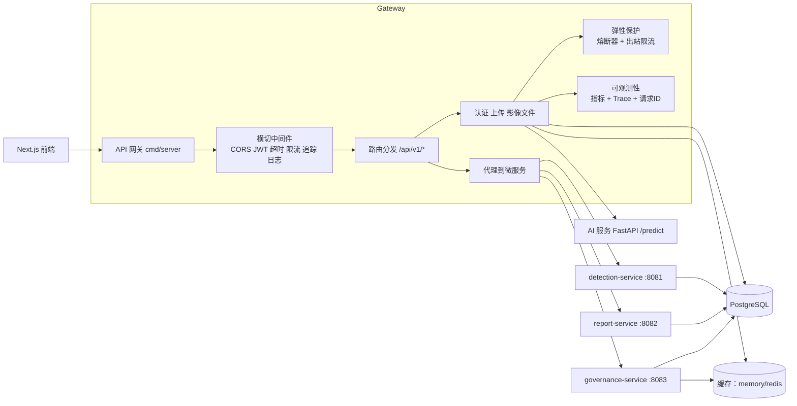
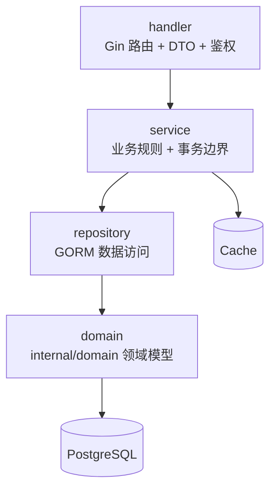

# 后端架构（Gin 微服务）

## 服务拓扑

- `api-gateway`（`cmd/server`）：认证、影像上传/文件访问、JWT 中间件、代理与兼容路由。
- `detection-service`（`cmd/detection-service`）：检测查询与复核域。
- `report-service`（`cmd/report-service`）：报告查询/创建/更新域。
- `governance-service`（`cmd/governance-service`）：审计、分析、运维域。

## 后端架构图

## AI 调用边界

- 前端只能调用后端 API。
- AI 服务必须由后端服务端处理器/服务层调用（如上传后检测流程）。
- 页面代码中禁止前端直连 `ai-service`。
- 建议部署为内网调用：`ai-service` 仅对后端开放，通过 `AI_SERVICE_URL` 访问。

## 分层设计（单服务）

## 组合根与依赖注入

- 网关 DI 组合根：`internal/platform/bootstrap/gateway.go`
- 服务与仓储在组合根统一构造，再注入到 handler。
- handler 内不直接创建 DB 连接、缓存客户端或仓储对象。
- 这样可保持测试边界清晰，避免隐藏耦合。

## 弹性设计

- 网关中间件层入站限流（`429` 保护）。
- 对 AI 与 HTTP 上游的出站保护：
  - 按键令牌桶限流
  - 熔断器（closed/open/half-open）
- 支持环境变量配置：
  - `INBOUND_RATE_LIMIT_RPS`, `INBOUND_RATE_LIMIT_BURST`
  - `AI_OUTBOUND_RATE_LIMIT_RPS`, `AI_OUTBOUND_RATE_LIMIT_BURST`
  - `UPSTREAM_BREAKER_FAIL_THRESHOLD`, `UPSTREAM_BREAKER_OPEN_SECONDS`, `UPSTREAM_BREAKER_HALF_OPEN_CALLS`

## 追踪与日志关联

- OpenTelemetry 初始化：`internal/observability/tracing.go`
- Gin trace 中间件为每个请求创建 span，并透传上游 trace context。
- 结构化日志包含：
  - `request_id`
  - `trace_id`
  - `span_id`

## 网关路由

网关保持 API 路径不变（`/api/v1/*`），并按环境变量代理：

- gRPC（优先）：
  - `DETECTION_SERVICE_GRPC_ADDR=detection-service:9081`
  - `REPORT_SERVICE_GRPC_ADDR=report-service:9082`
  - `GOVERNANCE_SERVICE_GRPC_ADDR=governance-service:9083`
- `DETECTION_SERVICE_URL=http://localhost:8081`
- `REPORT_SERVICE_URL=http://localhost:8082`
- `GOVERNANCE_SERVICE_URL=http://localhost:8083`

如果配置了 gRPC 地址，网关优先走 gRPC 进行服务间调用。  
如果 gRPC 与 HTTP 地址都未配置，网关会回退到本地 handler 以保持兼容。

## 当前改造状态

- ORM 模型已统一下沉至 `internal/domain`。
- 业务 handler 已按 `repository/service/handler` 三层拆分并通过 DI 装配。
- detection/report/governance 三个服务已统一 HTTP+gRPC 生命周期与优雅关闭。
- 当未配置上游地址时，网关保留本地回退 handler 以兼容旧链路。

## 可观测性

- 可观测性基线与指标说明见：
  - `backend-go/OBSERVABILITY.md`

## API 文档

- 后端 API 说明见：
  - `backend-go/API.md`
