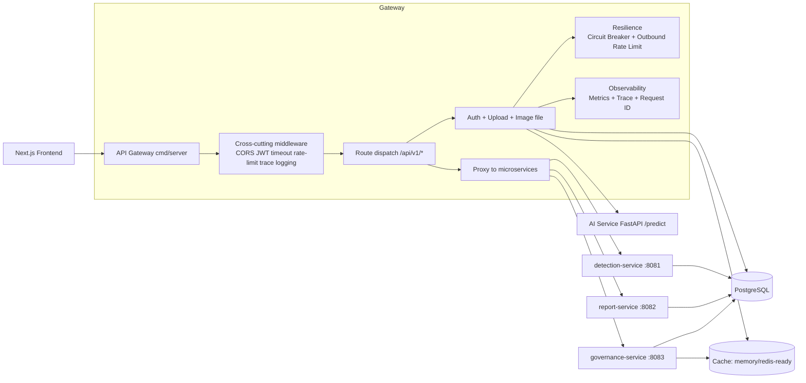
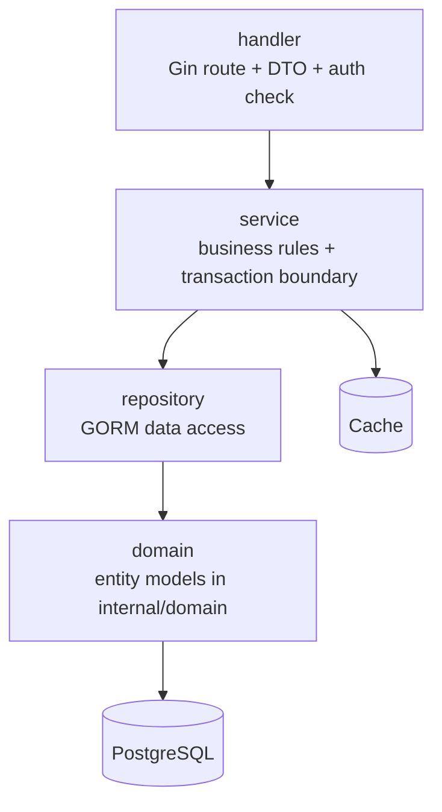

# Backend Architecture (Gin Microservices)

## Service Topology

- `api-gateway` (`cmd/server`): auth, image upload/file access, JWT middleware, proxy and compatibility routing.
- `detection-service` (`cmd/detection-service`): detection query/review domain.
- `report-service` (`cmd/report-service`): report query/create/update domain.
- `governance-service` (`cmd/governance-service`): audit, analytics, ops domain.

## Backend Architecture Diagram

## AI Call Boundary

- Frontend must call backend APIs only.
- AI service is called by backend server-side handlers/services (for example image upload detection flow).
- Do not expose direct frontend -> ai-service integration in page code.
- Recommended deployment: keep `ai-service` on internal network; backend accesses it via `AI_SERVICE_URL`.

## Layered Design (Per Service)

## Composition Root and Dependency Injection

- Gateway DI composition root: `internal/platform/bootstrap/gateway.go`
- Services and repositories are constructed once in composition root, then injected into handlers.
- Handlers do not create DB connections, cache clients, or repositories inside request logic.
- This keeps test seams clear and prevents hidden runtime coupling.

## Resilience

- Inbound rate limiter at gateway middleware level (`429` protection).
- Outbound protection to AI and HTTP upstream:
  - keyed token-bucket rate limiting
  - circuit breaker (closed/open/half-open)
- Configurable by env:
  - `INBOUND_RATE_LIMIT_RPS`, `INBOUND_RATE_LIMIT_BURST`
  - `AI_OUTBOUND_RATE_LIMIT_RPS`, `AI_OUTBOUND_RATE_LIMIT_BURST`
  - `UPSTREAM_BREAKER_FAIL_THRESHOLD`, `UPSTREAM_BREAKER_OPEN_SECONDS`, `UPSTREAM_BREAKER_HALF_OPEN_CALLS`

## Tracing and Logging Correlation

- OpenTelemetry tracing bootstrap: `internal/observability/tracing.go`
- Gin trace middleware opens spans per request and propagates upstream trace context.
- Structured logs include:
  - `request_id`
  - `trace_id`
  - `span_id`

## Gateway Routing

Gateway keeps API paths unchanged (`/api/v1/*`) and proxies by env:

- gRPC (preferred):
  - `DETECTION_SERVICE_GRPC_ADDR=detection-service:9081`
  - `REPORT_SERVICE_GRPC_ADDR=report-service:9082`
  - `GOVERNANCE_SERVICE_GRPC_ADDR=governance-service:9083`
- `DETECTION_SERVICE_URL=http://localhost:8081`
- `REPORT_SERVICE_URL=http://localhost:8082`
- `GOVERNANCE_SERVICE_URL=http://localhost:8083`

If gRPC addr is configured, gateway uses gRPC for service-to-service calls.
If both gRPC and HTTP are empty, gateway falls back to local handler for compatibility.

## Current Refactor Status

- ORM models are centralized in `internal/domain`.
- Domain handlers are split as `repository/service/handler` and wired through DI.
- Detection/report/governance binaries run with unified HTTP+gRPC lifecycle and graceful shutdown.
- Gateway retains local fallback handlers for compatibility when upstream URLs are not configured.

## Observability

- Baseline observability design and metrics are documented in:
  - `backend-go/OBSERVABILITY.md`

## API Documentation

- Backend API reference:
  - `backend-go/API.md`
